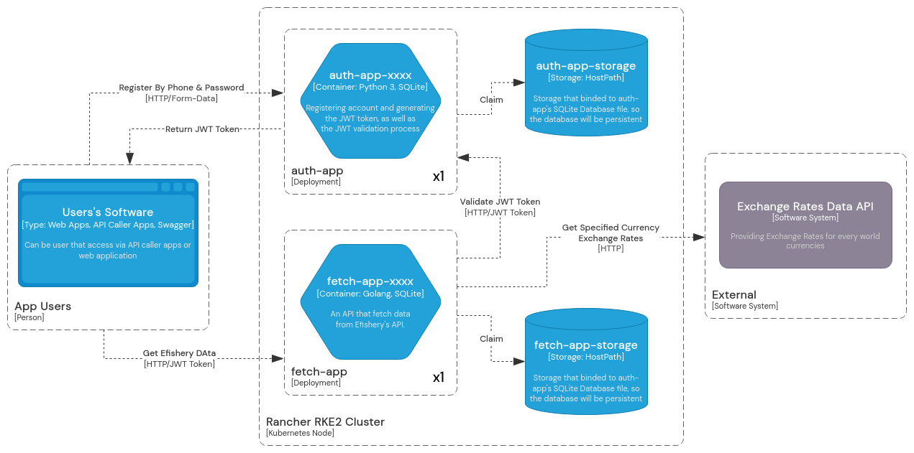
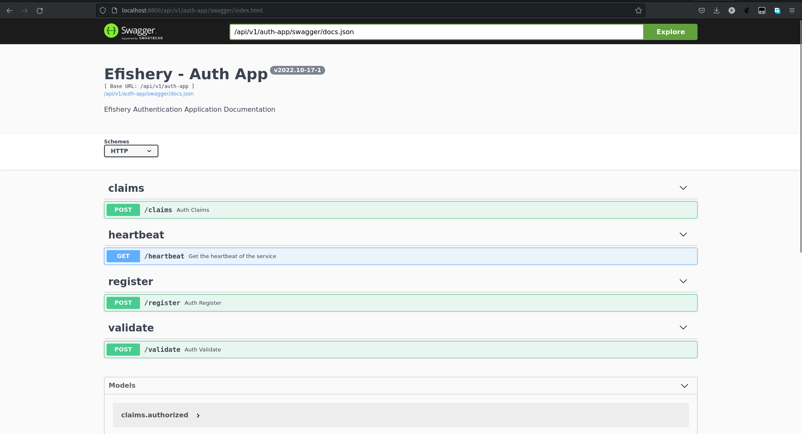
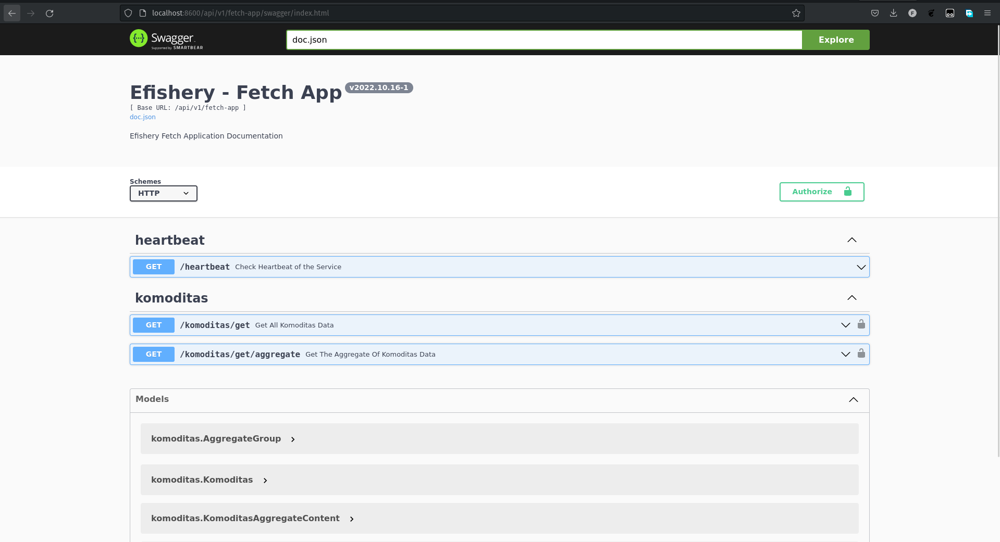
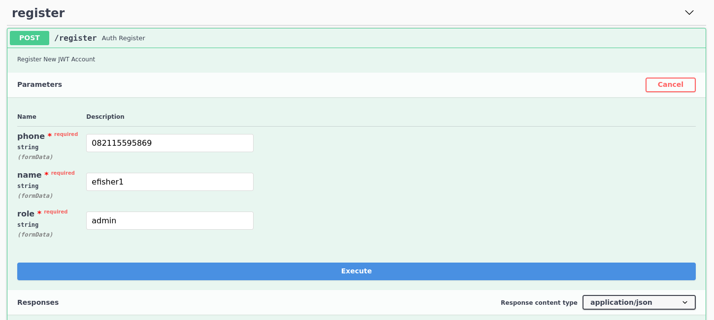
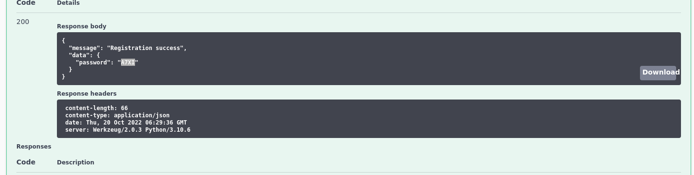
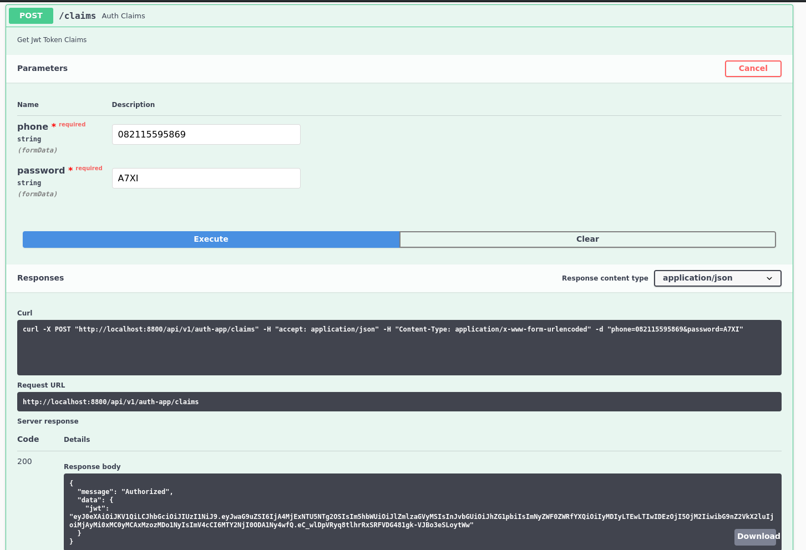
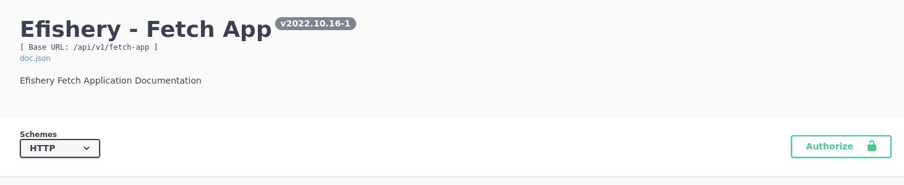
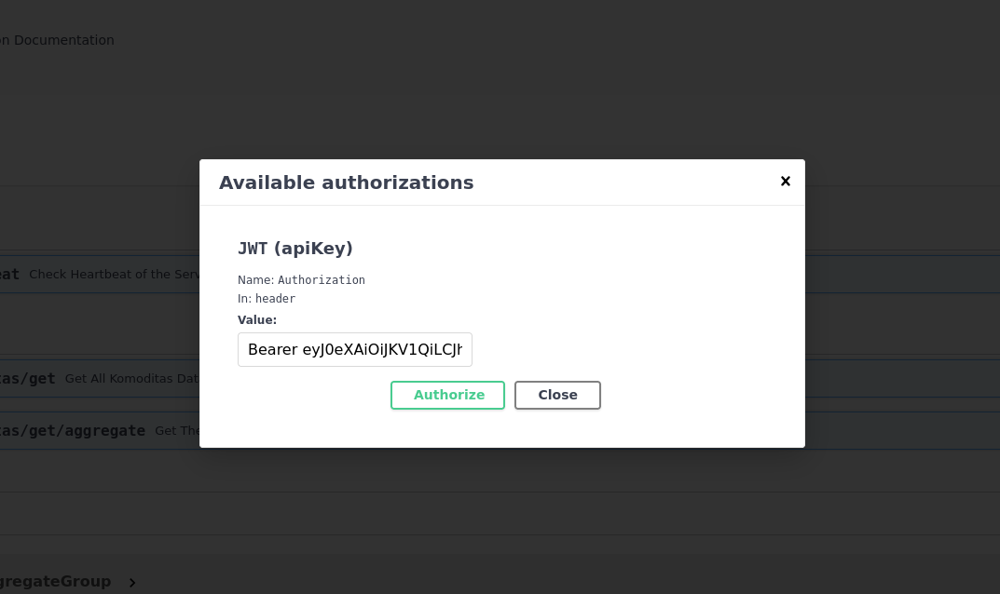
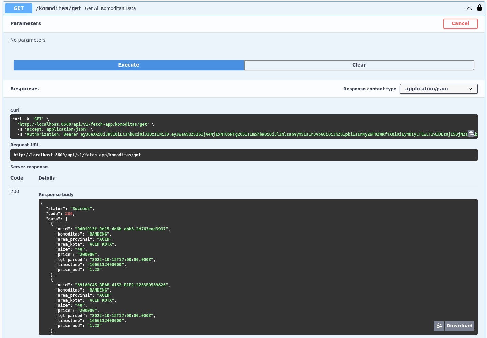
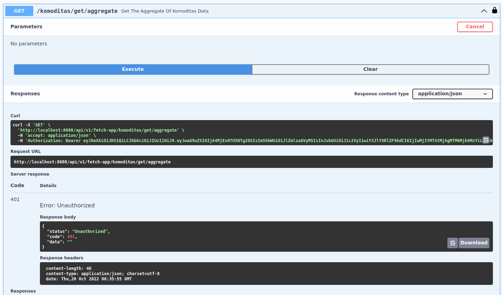

<a name="readme-top"></a>
[![LinkedIn][linkedin-shield]][linkedin-url]
<!-- PROJECT LOGO -->
<br />
<div align="center">
  <a href="https://github.com/github_username/repo_name">
    
  </a>

<h3 align="center">EFISHERY TASK</h3>

  <p align="center">
    My Efishery Skill Task Assignments
    <br />
    <!-- <a href="https://github.com/github_username/repo_name"><strong>Explore the docs »</strong></a> -->
    <a href="auth-app/">Auth App</a>
    ·
    <a href="fetch-app/">Fetch App</a>
    <br />
    <a href="http://sir-avdul.ddns.net:8800/api/v1/auth-app/swagger/index.html">Auth App Live Demo</a>
    ·
    <a href="http://sir-avdul.ddns.net:8600/api/v1/fetch-app/swagger/index.html">Fetch App Live Demo</a>
  </p>
</div>


<!-- TABLE OF CONTENTS -->
<details>
  <summary>Table of Contents</summary>
  <ol>
    <li>
      <a href="#about-the-project">About The Project</a>
      <ul>
        <li><a href="#built-with">Built With</a></li>
      </ul>
      <ul>
        <li><a href="#system-diagram">System Diagram</a></li>
      </ul>
    </li>
    <li>
      <a href="#getting-started">Getting Started</a>
      <ul>
        <li><a href="#prerequisites">Prerequisites</a></li>
      </ul>
    </li>
    <li>
        <a href="#auth-app-installation">Auth App Installation</a>
        <ul>
            <li><a href="#auth-manual-installation">Manual Installation</a></li>
        </ul>
        <ul>
            <li><a href="#auth-docker-installation">Docker Installation</a></li>
        </ul>
        <ul>
            <li><a href="#auth-kubernetes-installation">Kubernetes Installation</a></li>
        </ul>
    </li>
    <li>
        <a href="#fetch-app-installation">Fetch App Installation</a>
        <ul>
            <li><a href="#fetch-manual-installation">Manual Installation</a></li>
        </ul>
        <ul>
            <li><a href="#fetch-docker-installation">Docker Installation</a></li>
        </ul>
        <ul>
            <li><a href="#fetch-kubernetes-installation">Kubernetes Installation</a></li>
        </ul>
    </li>
    <li>
        <a href="#usage">Usage</a>
        <ul>
            <li><a href="#usage-step-by-step">Step By Step Usage</a></li>
        </ul>
    </li>
  </ol>
</details>

<!-- ABOUT THE PROJECT -->
## About The Project
**EFISHERY TASKS** is a *skill test assignment project* that given to me by the **Efishery** company. This project contains an **auth-app** and a **fetch-app** application. **auth-app** is the authentication application used by **fetch-app**. Meanwhile, **fetch-app** is an application that retrieves data from **Efishery**'s data api and provide a modified data of said data.

### Built With

[![Golang][Golang-lang]][Golang-url] [![Python][Python-lang]][Python-url] [![Swagger][Swagger]][Swagger-url] [![Docker][Docker]][Docker-url] [![Rancher][Rancher]][Rancher-url] ![Shell]
### System Diagram
The C4 Context Diagram of this project. 
<p align="center">
    
</p>
The C4 Deployment Diagram of this project.
<p align="center">
    
</p>

<!-- GETTING STARTED -->
## Getting Started
In order to get started, clone this repository into your computer.
```
git clone https://github.com/fahmyabdul/efishery-task.git
```
And then move into the efishery-task directory.
```
cd efishery-task/
```

### Prerequisites
To install this applications, there're some prerequisites that needs to be fulfilled/installed.
* <a href="https://go.dev/doc/install">golang</a>
* <a href="https://docs.conda.io/en/latest/miniconda.html">miniconda3</a>
* <a href="https://www.python.org/downloads/">python 3</a> (will be installed by miniconda3 later)
* <a href="https://docs.docker.com/engine/install/">docker</a> & <a href="https://docs.docker.com/compose/install/">docker-compose</a> (*optional, if you want to install on docker)
* kubernetes cluster (*optional, if you want to install on kubernetes, I use <a href="https://docs.rke2.io/">RKE2 distribution</a>)

## Auth App Installation

<h3 id="auth-manual-installation">Manual Installation</h3>

Makes sure that you've Miniconda3 installed, then from *efishery-task* directory, move into auth-app directory:
```
cd auth-app/
```
From there, execute this command in order to install the efishery auth-app python environment:
```
conda env create -f conda.yml
```
Wait for the installation to complete. Once done, execute this command in order to activate the conda environment:
```
conda activate efishery_auth_app_env
```
If activation successful, you'll see the environment name before the shell symbol, similar to:
```
(efishery_auth_app_env) $ .
```
Once the environment activated, start the application by executing this command:
```
python run.py auth-app
```
If successful, you'll see the `* Running on http://xxx.xxx.xx.x:8800/` log on your terminal. Test the api by executing this curl command:
```
curl http://localhost:8800/api/v1/auth-app/heartbeat
```
The api should return a json response similar to this if successful:
```
{"version": "v2022.10-17-1", "last_check": "2022-10-20 12:12:50"}
```
Now the auth-app has been installed successfully.

<h3 id="auth-docker-installation">Docker Installation</h3>

For docker installation, we recommends you to use the `docker-compose.yml` file for a quick installation.

From auth-app directory, execute this command to start the docker container:
```
docker-compose -f deployments/compose/docker-compose.yml up
```
Wait for docker to pull the docker image. Once done, you'll see the `* Running on http://xxx.xxx.xx.x:8800/` log on your terminal. Test the api by executing this curl command:
```
curl http://localhost:8800/api/v1/auth-app/heartbeat
```
The api should return a json response similar to this if successful:
```
{"version": "v2022.10-17-1", "last_check": "2022-10-20 12:12:50"}
```
If you want to start the docker container in detached mode, add `-d` to the end of `docker-compose` command, like this:
```
docker-compose -f deployments/compose/docker-compose.yml up -d
```
For detached mode, you won't see the log on your terminal, to see the log, execute this docker command:
```
docker logs -f auth-app
```
Now the auth-app has been installed successfully.

<h3 id="auth-kubernetes-installation">Kubernetes Installation</h3>

For Kubernetes installation, execute this command from auth-app directory:
```
kubectl apply -f deployments/kubernetes/auth-app.yml
```
This kubernetes file contained the `storage`, `storage-claim`, `service`, and `deployments` configuration, you might need to change some of the configuration values in order to adjust to your prefered kubernetes.


## Fetch App Installation

<h3 id="fetch-manual-installation">Manual Installation</h3>

Makes sure that you've golang installed, then from *efishery-task* directory, move into fetch-app directory:
```
cd fetch-app/
```
From there, execute this command in order to install the efishery fetch-app modules:
```
go mod tidy
```
Once done, start the application by executing this command:
```
bash scripts/run.sh --app fetch-app
```
If successful, you'll see the `....Successfully starting Fetch App....` log on your terminal. Test the api by executing this curl command:
```
curl http://localhost:8600/api/v1/fetch-app/heartbeat
```
The api should return a json response similar to this if successful:
```
{"version":"v2022.10.16-1","last_check":"2022-10-20 12:41:14"}
```
Now the fetch-app has been installed successfully.

<h3 id="fetch-docker-installation">Docker Installation</h3>

For docker installation, we recommends you to use the `docker-compose.yml` file for a quick installation.

From fetch-app directory, execute this command to start the docker container:
```
docker-compose -f deployments/compose/docker-compose.yml up
```
Wait for docker to pull the docker image. Once done, you'll see the `....Successfully starting Fetch App....` log on your terminal. Test the api by executing this curl command:
```
curl http://localhost:8800/api/v1/auth-app/heartbeat
```
The api should return a json response similar to this if successful:
```
{"version":"v2022.10.16-1","last_check":"2022-10-20 12:41:14"}
```
If you want to start the docker container in detached mode, add `-d` to the end of `docker-compose` command, like this:
```
docker-compose -f deployments/compose/docker-compose.yml up -d
```
For detached mode, you won't see the log on your terminal, to see the log, execute this docker command:
```
docker logs -f fetch-app
```
Now the fetch-app has been installed successfully.

<h3 id="fetch-kubernetes-installation">Kubernetes Installation</h3>

For Kubernetes installation, execute this command from fetch-app directory:
```
kubectl apply -f deployments/kubernetes/fetch-app.yml
```
This kubernetes file contained the `storage`, `storage-claim`, `service`, and `deployments` configuration, you might need to change some of the configuration values in order to adjust to your prefered kubernetes.

<!-- USAGE -->
## Usage
For the api documentation, you can visit the **swagger-ui** of each application. Visit these url from your browser:

auth-app
```
http://localhost:8800/api/v1/auth-app/swagger/index.html
```
<p align="center">
    
</p>

fetch-app
```
http://localhost:8600/api/v1/fetch-app/swagger/index.html
```
<p align="center">
    
</p>

<h3 id="usage-step-by-step">Step By Step Usage</h3>

1. On Auth App
- Register new user at `/register` section, click the `Try it out` button and fills the phone, name, and role inputs (the role is either `admin` or `user`), copy the **password** from response body
  
<p align="center">
    
    
</p>

- Claim the token on auth-app at `/claims` section, click the `Try it out`, fills the phone and password input, then copy the `jwt token` from response body
  
<p align="center">
    
</p>

2. On Fetch App
- Click the `Authorize` button, type `Bearer <jwt token that you got from /claims>`, for example:
  ```
    Bearer egv0eXAiOiJKV1QiLCJhbGciOiJIUzI1NiJ9.eyJwaG9uZsI6IjA4MjExNjY5NTg2OCIsIm5hbWUiOiJGYWhteSBBYmR1bCIsInJvbGUiOiJhZG1pbiIsImNyZWF0ZWRfYXriOiIyMDIyLTEwLTIwIDA1OjM1OjA2IiwibG9nZ2VkX2luIjoiMjAyMi0xMC0yMCAwODozNDo1NyIsImV4cCI6MTY2NjIzMDI5Ny4wfQ.an-Eq7SQcWzNUQjNs8_R4cxrfselz6-4GVLEr7FOxVc
  ```
  
<p align="center">
    
    
</p>

- Click the `Authorize` button, then you can try the `/komuditas/get` and `/komuditas/get/aggregate`, example of `/komuditas/get`:
  
<p align="center">
    
</p>

- The `/komuditas/get/aggregate` is for admin role only, so if your user is of user role, then you'll get `Unauthorized` response, like this:
  
<p align="center">
    
</p>

<p align="right">(<a href="#readme-top">back to top</a>)</p>


<!-- MARKDOWN LINKS & IMAGES -->
<!-- https://www.markdownguide.org/basic-syntax/#reference-style-links -->
[linkedin-shield]: https://img.shields.io/badge/-LinkedIn-black.svg?style=for-the-badge&logo=linkedin&colorB=555
[linkedin-url]: https://linkedin.com/in/fahmyabdul
[product-screenshot]: images/screenshot.png
[Golang-lang]: https://img.shields.io/badge/go-%2300ADD8.svg?style=for-the-badge&logo=go&logoColor=white
[Golang-url]: https://go.dev/
[Python-lang]:https://img.shields.io/badge/python-3670A0?style=for-the-badge&logo=python&logoColor=ffdd54
[Python-url]: https://www.python.org/
[Docker]:https://img.shields.io/badge/docker-%230db7ed.svg?style=for-the-badge&logo=docker&logoColor=white
[Docker-url]: https://www.docker.com/
[Rancher]: https://img.shields.io/badge/rancher-%230075A8.svg?style=for-the-badge&logo=rancher&logoColor=white
[Rancher-url]: https://www.rancher.com/
[Swagger]: https://img.shields.io/badge/-Swagger-%23Clojure?style=for-the-badge&logo=swagger&logoColor=white
[Swagger-url]: https://swagger.io/
[Shell]: https://img.shields.io/badge/shell_script-%23121011.svg?style=for-the-badge&logo=gnu-bash&logoColor=white