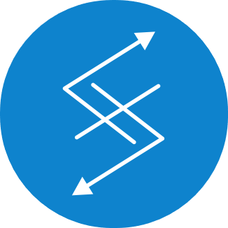

<a name="readme-top"></a>
[![LinkedIn][linkedin-shield]][linkedin-url]
<!-- PROJECT LOGO -->
<br />
<div align="center">
  <a href="https://github.com/github_username/repo_name">
    
  </a>

<h3 align="center">Self Growth</h3>

  <p align="center">
    Repository for learning
    <br />
    <a href="http://sir-avdul.ddns.net:8600/api/v1/fetch-app/swagger/index.html" target="_blank">Live Demo</a>
  </p>
</div>


<!-- TABLE OF CONTENTS -->
<details>
  <summary>Table of Contents</summary>
  <ol>
    <li>
      <a href="#about-the-project">About The Project</a>
      <ul>
        <li><a href="#built-with">Built With</a></li>
      </ul>
      <ul>
        <li><a href="#system-diagram">System Diagram</a></li>
      </ul>
    </li>
    <li>
      <a href="#getting-started">Getting Started</a>
      <ul>
        <li><a href="#prerequisites">Prerequisites</a></li>
      </ul>
    </li>
    <li>
        <a href="#auth-app-installation">Auth App Installation</a>
        <ul>
            <li><a href="#auth-manual-installation">Manual Installation</a></li>
        </ul>
        <ul>
            <li><a href="#auth-docker-installation">Docker Installation</a></li>
        </ul>
        <ul>
            <li><a href="#auth-kubernetes-installation">Kubernetes Installation</a></li>
        </ul>
    </li>
    <li>
        <a href="#fetch-app-installation">Fetch App Installation</a>
        <ul>
            <li><a href="#fetch-manual-installation">Manual Installation</a></li>
        </ul>
        <ul>
            <li><a href="#fetch-docker-installation">Docker Installation</a></li>
        </ul>
        <ul>
            <li><a href="#fetch-kubernetes-installation">Kubernetes Installation</a></li>
        </ul>
    </li>
    <li>
        <a href="#usage">Usage</a>
        <ul>
            <li><a href="#usage-configuration">Configuration</a></li>
            <li>
              <a href="#usage-documentations">Documentations</a>
              <ul>
                <li><a href="#usage-step-by-step">Step By Step Usage</a></li>
              </ul>
            </li>
        </ul>
    </li>
  </ol>
</details>

<!-- ABOUT THE PROJECT -->
## About The Project
This repository contains codes that are created for learning purpose. 

### Built With

[![Golang][Golang-lang]][Golang-url] [![Swagger][Swagger]][Swagger-url] [![Docker][Docker]][Docker-url] [![Rancher][Rancher]][Rancher-url] ![Shell]

<!-- GETTING STARTED -->
## Getting Started
In order to get started, clone this repository into your computer.
```
git clone https://github.com/fahmyabdul/self-growth.git
```
And then move into the fetch-app directory.
```
cd self-growth/fetch-app
```

### Prerequisites
To install this applications, there're some prerequisites that needs to be fulfilled/installed.
* <a href="https://go.dev/doc/install">golang</a>
* <a href="https://docs.docker.com/engine/install/">docker</a> & <a href="https://docs.docker.com/compose/install/">docker-compose</a> (*optional, if you want to install on docker)
* kubernetes cluster (*optional, if you want to install on kubernetes, I use <a href="https://docs.rke2.io/">RKE2 distribution</a>)

## Installation

<h3 id="fetch-manual-installation">Manual Installation</h3>

Makes sure that you've golang installed, then execute this command in order to install the fetch-app modules:
```
go mod tidy
```
Once done, start the application by executing this command:
```
bash scripts/run.sh --app fetch-app
```
If successful, you'll see the `....Successfully starting Fetch App....` log on your terminal. Test the api by executing this curl command:
```
curl http://localhost:8600/api/v1/fetch-app/heartbeat
```
The api should return a json response similar to this if successful:
```
{"version":"v2022.10.16-1","last_check":"2022-10-20 12:41:14"}
```
Now the fetch-app has been installed successfully.

<h3 id="fetch-docker-installation">Docker Installation</h3>

For docker installation, we recommends you to use the `docker-compose.yml` file for a quick installation.

From fetch-app directory, execute this command to start the docker container:
```
docker-compose -f deployments/compose/docker-compose.yml up
```
Wait for docker to pull the docker image. Once done, you'll see the `....Successfully starting Fetch App....` log on your terminal. Test the api by executing this curl command:
```
curl http://localhost:8800/api/v1/auth-app/heartbeat
```
The api should return a json response similar to this if successful:
```
{"version":"v2022.10.16-1","last_check":"2022-10-20 12:41:14"}
```
If you want to start the docker container in detached mode, add `-d` to the end of `docker-compose` command, like this:
```
docker-compose -f deployments/compose/docker-compose.yml up -d
```
For detached mode, you won't see the log on your terminal, to see the log, execute this docker command:
```
docker logs -f fetch-app
```
Now the fetch-app has been installed successfully, to stop the running container, execute this docker command:
```
docker-compose -f deployments/compose/docker-compose.yml down
```

<h3 id="fetch-kubernetes-installation">Kubernetes Installation</h3>

For Kubernetes installation, execute this command from fetch-app directory:
```
kubectl apply -f deployments/kubernetes/fetch-app.yml
```
This kubernetes file contained the `storage`, `storage-claim`, `service`, and `deployments` configuration, you might need to change some of the configuration values in order to adjust to your prefered kubernetes.

<!-- USAGE -->
## Usage

<h3 id="usage-configuration">Configuration</h3>

You can configure both apps to run on different ports that you wants. Both auth-app and fetch-app directory have `.configs.yml` file that act as the **configuration file** of each application. 

You can either edit the existing configuration file, or create a new configuration file based on existing configuration file.

<h4 id="usage-edit-existing">Edit Existing Configuration File</h4>

On either auth-app or fetch-app, edit the `.configs.yml` config values before starting the app. The port configuration is in `services` -> `restapi` -> `port` fields.

<h4 id="usage-edit-existing">Create New Configuration File</h4>

Copy the existing config file to a new file with different name, for example:
```
cp .configs.yml .configs.local.yml
```
Edit the port config in `services` -> `restapi` -> `port` field, then run the app while using `--config` flag like this:
```
bash scripts/run.sh --app fetch-app --config .configs.local.yml
```


<h3 id="usage-documentations">Documentations</h3>

For the api documentation, you can visit the **swagger-ui** of each application. Visit these url from your browser:

fetch-app
```
http://localhost:8600/api/v1/fetch-app/swagger/index.html
```


<p align="right">(<a href="#readme-top">back to top</a>)</p>


<!-- MARKDOWN LINKS & IMAGES -->
<!-- https://www.markdownguide.org/basic-syntax/#reference-style-links -->
[linkedin-shield]: https://img.shields.io/badge/-LinkedIn-black.svg?style=for-the-badge&logo=linkedin&colorB=555
[linkedin-url]: https://linkedin.com/in/fahmyabdul
[product-screenshot]: images/screenshot.png
[Golang-lang]: https://img.shields.io/badge/go-%2300ADD8.svg?style=for-the-badge&logo=go&logoColor=white
[Golang-url]: https://go.dev/
[Python-lang]:https://img.shields.io/badge/python-3670A0?style=for-the-badge&logo=python&logoColor=ffdd54
[Python-url]: https://www.python.org/
[Docker]:https://img.shields.io/badge/docker-%230db7ed.svg?style=for-the-badge&logo=docker&logoColor=white
[Docker-url]: https://www.docker.com/
[Rancher]: https://img.shields.io/badge/rancher-%230075A8.svg?style=for-the-badge&logo=rancher&logoColor=white
[Rancher-url]: https://www.rancher.com/
[Swagger]: https://img.shields.io/badge/-Swagger-%23Clojure?style=for-the-badge&logo=swagger&logoColor=white
[Swagger-url]: https://swagger.io/
[Shell]: https://img.shields.io/badge/shell_script-%23121011.svg?style=for-the-badge&logo=gnu-bash&logoColor=white